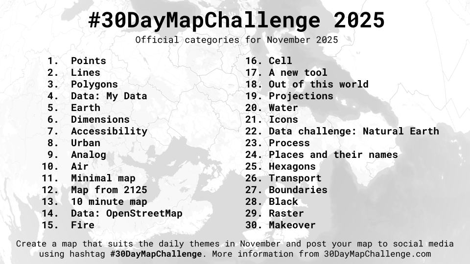

# Process: 30 Day Map Challenge

This document is for Day 23. Process. Show how you make a map. This could be a tutorial, a step-by-step graphic, a blog post, a video, or a screenshot of your work environment. Combine it with a map from another day! See the full list here <https://30daymapchallenge.com/>. This is based on the previous day Data challenge: Natural Earth.



## Making a 'simple' map

To make a figure of the North South Divide in the UK, we will need to find some administrative boundaries from an authoritative source. Firstly, lets load some key packages we will need using the `pacman` library and the `p_load` function which can help us by installing any library that is missing. We will want to use rnaturalearth - for the boundaries with sf and tmap - for the spatial elements and visualisation alongside tidyverse - for data wrangling.

```{r load libraries}
pacman::p_load(rnaturalearth, sf, tmap, tidyverse)
```

Next, lets get the administrative boundaries of the United Kingdom to use in our figure. To do this we use the ne_states() command from {rnaturalearth} library which gives us sub national boundaries. We need to input the country required, for example the United Kingdom, the file format we want back, in this case an `sf` format.

```{r get file}
UK <- ne_states(country="United Kingdom", returnclass = "sf")
```

A quick test to see if this has downloaded as desired is to produce a simple map using `tmap`, or whichever spatial visualisation works for you. Other possibilities include `ggplot2` and `leaflet` among others. For `tmap`, we need to specify the file (UK) within the `tm_shape` function and then use either `tm_polygons`, `tm_borders` or `tm_fill` to create a map. Have a look at the three maps below to see the subtle differences and then query `?tm_borders` using the question mark to understand the arguments needed for each.

```{r map UK}
tm_shape(UK) + tm_polygons()
tm_shape(UK) + tm_borders()
tm_shape(UK) + tm_fill()
```

Next, lets decide which places are in the North, and which are in the south. We can do this by seeing what regions we have available to put into categories.

```{r regions}
unique(UK$region)
```

After seeing that there are 16 regions, we want to assign a value to each in order to be able to map the North-South divide. Using the `tidyverse` package to do some basic data wrangling and variable creation with the `mutate` and the `case_when` functions will help us get there. We will create a variable called `DIVIDE` to use as a category for future mapping by creating a binary north or south set of responses for each region in the spatial file of the UK.

```{r ns categorical}
UK <- UK |>
  mutate ( DIVIDE = case_when(
    region =="South East" ~ "South",
    region =="East" ~ "South",
    region =="South West" ~ "South",
    region =="Greater London" ~ "South",
    TRUE ~ "North" )) # Default category - for the other 12
```

Now for the slightly more complicated part. We can now set up a custom palette to use in mapping. To do this we select our desired colours for the north and the south.

```{r custom palette}
NS_palette <- c("South"="dodgerblue2", North="firebrick")
```

Next, we will make a map using the `tmap` package. It is easier to do this in steps, to try and ease understanding of the different commands and options, which are myriad!

Firstly, lets just colour in map polygons and add a title using `tm_polygons` and `tm_title` commands. A title is fairly easy to explain, we simply add the text "North-South Divide" within the command so that `tm_title(text="North-South Divide", size = 2.5)` becomes the title and we can adjust the size also, lets go for 2.5 times bigger.

We use our shape, the UK, within the `tm_shape` command as before. This time however, we want to fill in the polygons using the DIVIDE variable, `fill="DIVIDE"` that we created. The critical part is to use `fill.scale` to set the values from our previously created custom palette. To do this we use `tm_scale(values = NS_palette)` which will pull either the north or south colours that we set up in our custom palette and assign these to each region in the map. Finally, we set the border of the polygon colours to NULL `col=NULL`, as we haven't properly merged the underlying polygons and we want to hide this. The last step is then to suppress the legend using the `tm_legend_hide()` option. I've also added a command to stop tmap autoscaling using `tmap_options(component.autoscale = FALSE)`.

```{r map simple}
NSmap <-
  tm_shape(UK) +
  tm_polygons(fill="DIVIDE",
              fill.scale = tm_scale(values = NS_palette),
              col=NULL, fill.legend = tm_legend_hide())+
  tm_title(text="North-South Divide", size = 2.5) +
  tmap_options(component.autoscale = FALSE)
NSmap
```

After a reasonably simple map, we need to add a few more parameters and arguments to further customise the figure further. The command `tm_credits` allows us to add in text relating to data sources and other items using the `\n` adds a new line and the position it where it needs to go, so the center and bottom of the figure. I have also chosen a specific text `fontface` of bold and `fontfamily` of mono and added a background that is black using `bg.color` with white text using `color="white"` and again, the `size` parameter changes the size of the text. Our final tweak is to use the `tm_layout` command to adjust the background colour of the map and drop the frame, using `frame=F` to get rid of the standard box around the plot.

```{r map it}
#| warning: false
NSmap <-
  tm_shape(UK) +
  tm_polygons("DIVIDE", fill.scale = tm_scale(values = NS_palette), col=NULL, fill.legend = tm_legend_hide())+
  tm_title(text="North-South Divide", size = 1.5,
           frame=F, fontface = "bold", fontfamily = "mono",
           color = "white", bg = TRUE, bg.color = "black", 
           position = tm_pos_out("center", "top", pos.h = "center") )+
  tm_layout(bg.color = "aliceblue", Frame=F)  +
  tm_credits(text ="Created by Prof. Malcolm Campbell \nData: rnaturalearth boundaries",
             position = tm_pos_out("center", "bottom", pos.h = "center"),
             size=0.75, fontface = "bold", fontfamily = "mono",
             color = "white", bg = TRUE, bg.color = "black", ) +
  tmap_options(component.autoscale = FALSE)
NSmap
```

Lastly, we might want to save our map and share it using the `tmap_save` command. We need to put in our map object, called NSmap, choose a filename and format, for example .png alongside a height, width and dots per inch (dpi) value.

```{r save it}
#| warning: false
tmap_save(NSmap, filename = "./maps/Day22_NS.png", height = 12, width = 12, dpi=400)
```

There you have it. A 'simple' map.
